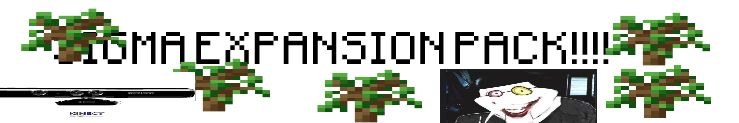

This is a ***tuff 🥀*** Minecraft Mod, developed in Fabric for Minecraft 1.20.1. 

This mod came from the several ideas from a Voice Chat in the OneShot Discord Server.

> ## ATTENTION!!!
> Do not use this mod with other mods. This mod changes a lot of the Minecraft code!
> 
> This means that you're recommended to only toy around with this mod for fun and not make serious progress twin 🥀
> 
> *So yeah, remember: you only have ONE SHOT at your world.*

> ## WORK IN PROGRESS:
> The mod is still being worked on.
> There are still some ideas left to be worked on:
> 1. [X] Sigma Block
> 2. [X] Only Have OneShot (Only One World at a time.)
> 3. [ ] Mango Item
> 4. [ ] Kendrick Lamarr
> 5. [X] Tool Changes
> 6. [X] Item Changes
> 7. [ ] Tuff Block Changes
> 8. [ ] Villager Changes
> 9. [ ] Replace Netherrack with TUFF 🥀
> 
> ***DO NOT FORGET!***
> 
> This is a simplified list of stuff being worked on. If you want the full list of ideas, please check them out [here.](readme_sources/tuff_ideas.docx)
> 
> If you are contributing to this modpack, please fill out this README file if you are finished with something. 

> ## Minimum-Requirements
> 
> - some sanity left
> - Gradle (9.2.1)
> - Java (Microsoft OpenJDK 21)
> - ***Minecraft 1.20.1***
> 
> You are recommended to use IntelliJ IDEA to change this mod/make contributions. Other IDEs will work fine,
> You can use Fabric's IDE Guide [here](https://docs.fabricmc.net/develop/getting-started/setting-up) for the new documentation, 
> or [here](https://wiki.fabricmc.net/tutorial:setup) for the old documentation.

> ## Wanna know who made the Ideas?
> 
> Each new addition's \*.java file will have the original idea holder added into the top
> as a comment. ***So, you can know our skibidi ohio minds who made this possible.***